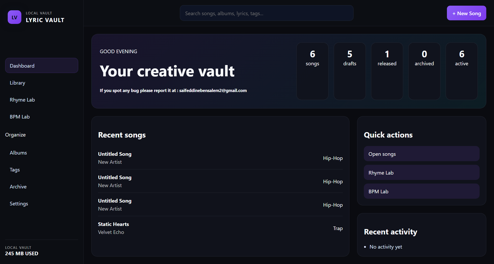
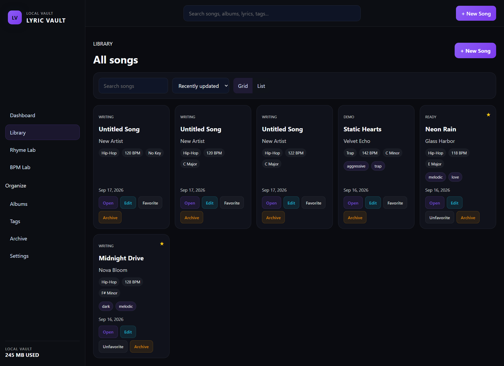
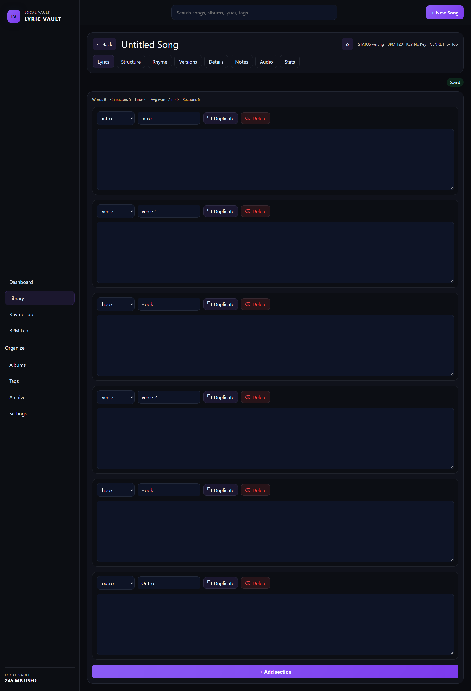
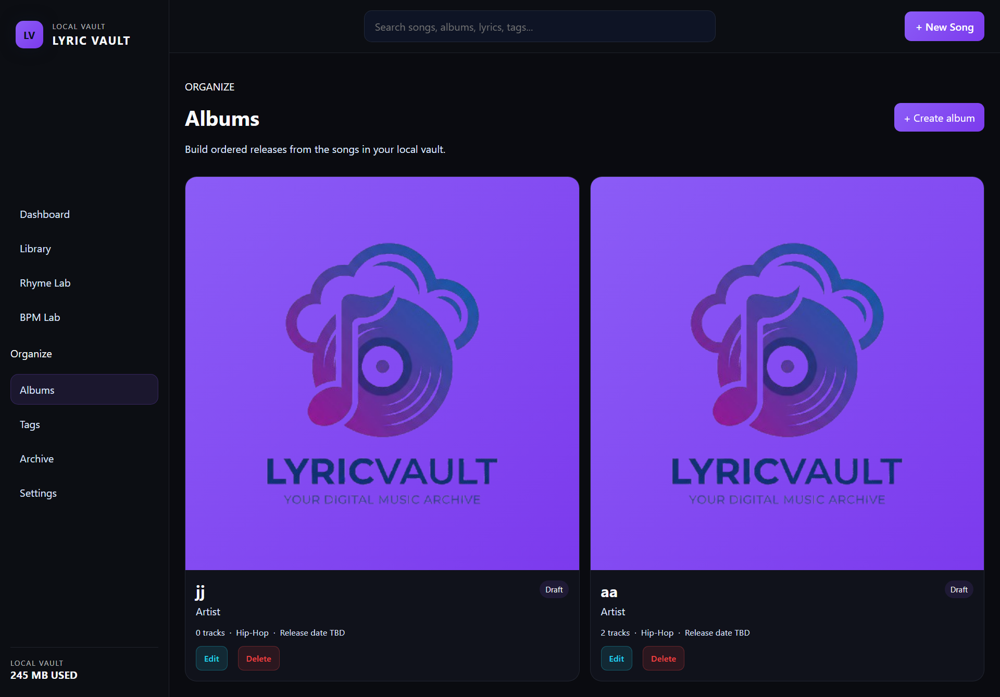
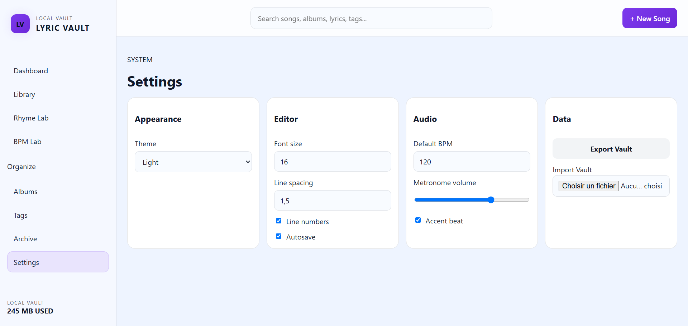

# LyricVault

<p align="center">
  
  
  
  
</p>

<p align="center">
  <strong>LyricVault</strong> is a local-first music writing workspace built with Angular for organizing songs, albums, lyric drafts, versions, tags, audio references, and writing analysis in one place.
</p>

<p align="center">
  <a href="#features">Features</a> ·
  <a href="#architecture">Architecture</a> ·
  <a href="#getting-started">Getting Started</a> ·
  <a href="#project-structure">Project Structure</a> ·
  <a href="#usage">Usage</a>
</p>

---

## Overview

LyricVault is designed for artists, songwriters, and producers who want a focused environment for managing lyric ideas from raw concepts to finished songs. It stores data locally in the browser using IndexedDB, so the application behaves like a lightweight personal music database without needing a backend service.

The app includes:

- Song and album management
- Structured lyric sections and editable song metadata
- Version snapshots for lyric history
- Search, filters, sorting, and tags
- BPM tools and rhyme analysis
- Instrumental/audio attachment support
- Archive and restore workflows
- Export/import of vault data
- Dark theme personalization and app settings

---

## Features

### Song workspace

- Create, edit, archive, and restore songs
- Manage metadata such as title, artist, genre, mood, BPM, key, time signature, language, and status
- Organize song sections like intro, verse, hook, bridge, breakdown, and outro
- Track lyrics, notes, tags, and favorites
- Save automatically and maintain a live local song list

### Versioning and revision history

- Save named lyric snapshots as versions
- Compare versions side by side
- Restore previous lyric states when needed
- View version parents and metadata for each save point

### Album management

- Create and maintain albums with artist, genre, description, and track relationships
- Connect songs to albums and navigate directly from album to song workspace
- Keep song collections organized by release or project

### Writing tools

- Rhyme analysis for lyric endings and internal rhymes
- BPM lab for tempo-based writing support
- Search feature across songs and albums
- Tag-based organization and filtered querying

### Audio and media support

- Upload instrumental audio files for a song
- Store external instrumental URLs
- Preview, manage, and remove audio references from the workspace

### Data protection and portability

- Local persistence with IndexedDB
- Full vault export of songs, versions, tags, history, settings, audio, and albums
- Import JSON backup payloads into the same database structure

### Settings and personalization

- Theme modes: dark, light, and system-aware
- Editor settings for font size, spacing, and line numbers
- Metronome preferences and default BPM configuration
- App-level customization with saved preferences

---

## Tech Stack

- Angular 17
- TypeScript
- RxJS
- IndexedDB for browser local persistence
- Angular CDK for drag-and-drop section ordering
- Karma + Jasmine for unit testing

---

## Project Architecture

The app is built around a modular service layer and local database layer.

### Core responsibilities

- `src/app/core/database/` handles IndexedDB creation, schema setup, and CRUD operations
- `src/app/core/models/` contains the typed data contracts for songs, albums, settings, lyrics, versions, tags, and history
- `src/app/core/services/` contains the application logic for songs, albums, settings, rhyme analysis, statistics, search, export/import, and versioning
- `src/app/pages/` contains the user-facing views and workflows
- `src/app/layout/` contains the shell layout and navigation structure

### Routing

The router includes the following main screens:

- `/dashboard`
- `/songs`
- `/songs/:id`
- `/albums`
- `/albums/:id`
- `/rhyme-lab`
- `/bpm-lab`
- `/tags`
- `/archive`
- `/settings`

---

## Project Structure

```text
lyric-vault/
├── angular.json
├── package.json
├── tsconfig.json
├── tsconfig.app.json
├── tsconfig.spec.json
├── README.md
├── src/
│   ├── app/
│   │   ├── app.component.ts
│   │   ├── app.config.ts
│   │   ├── app.routes.ts
│   │   ├── core/
│   │   │   ├── database/
│   │   │   │   ├── database.service.ts
│   │   │   │   └── database.types.ts
│   │   │   ├── models/
│   │   │   │   ├── album.model.ts
│   │   │   │   ├── app-settings.model.ts
│   │   │   │   ├── audio.model.ts
│   │   │   │   ├── history.model.ts
│   │   │   │   ├── lyric-section.model.ts
│   │   │   │   ├── lyric-version.model.ts
│   │   │   │   ├── song.model.ts
│   │   │   │   └── tag.model.ts
│   │   │   └── services/
│   │   │       ├── album.service.ts
│   │   │       ├── audio.service.ts
│   │   │       ├── bpm.service.ts
│   │   │       ├── export-import.service.ts
│   │   │       ├── notification.service.ts
│   │   │       ├── rhyme.service.ts
│   │   │       ├── search.service.ts
│   │   │       ├── settings.service.ts
│   │   │       ├── song.service.ts
│   │   │       ├── statistics.service.ts
│   │   │       └── version.service.ts
│   │   ├── layout/
│   │   │   └── app-shell/
│   │   └── pages/
│   │       ├── album-details/
│   │       ├── albums/
│   │       ├── archive/
│   │       ├── bpm-lab/
│   │       ├── dashboard/
│   │       ├── rhyme-lab/
│   │       ├── settings/
│   │       ├── song-workspace/
│   │       ├── songs/
│   │       └── tags/
│   ├── assets/
│   ├── index.html
│   ├── main.ts
│   └── styles.scss
└── package-lock.json
```

---

## Getting Started

### Prerequisites

Before running the project, make sure you have:

- Node.js 18 or newer
- npm 9 or newer
- A modern browser such as Chrome, Edge, or Firefox

### Installation

```bash
npm install
```

### Run the app locally

```bash
npm start
```

Then open:

```text
http://localhost:4200/
```

The Angular dev server will rebuild automatically when source files change.

### Production build

```bash
npm run build
```

The compiled output is generated in the `dist/` directory.

### Run tests

```bash
npm test
```

This starts the Angular test runner with Karma and Jasmine.

---

## App Workflow

### 1. Create a song

From the dashboard or songs section, create a new song entry. The application stores it in IndexedDB and displays it in the global song list.

### 2. Edit lyric structure

Open a song from the workspace and use the lyric editor to manage sections such as:

- Intro
- Verse
- Pre-Hook
- Hook
- Bridge
- Breakdown
- Outro
- Interlude
- Custom sections

You can reorder sections using drag-and-drop.

### 3. Save versions

Use the versioning panel to keep checkpoints of lyric drafts and compare them over time.

### 4. Analyze writing quality

The app includes rhyme and stats analysis tools to support songwriting, including:

- end-word rhyme detection
- internal rhyme grouping
- rhyme density/structure overview
- lyrical line and section statistics

### 5. Organize releases

Use albums, tags, and archive states to organize songs by project, phase, or release readiness.

---

## Data Model Highlights

### Song

A song includes:

- id
- title
- artist
- genre
- subGenre
- bpm
- key
- timeSignature
- language
- mood
- status
- albumId
- sections
- tags
- favorite
- notes
- timestamps

### Lyric section

Each lyric section includes:

- id
- type
- name
- content
- order
- timestamps

### Settings

The app stores user preferences such as:

- theme
- editor font size
- line spacing
- line numbers
- autosave
- metronome volume
- default BPM

---

## Storage and Persistence

LyricVault is designed as a local-first application using IndexedDB, which means:

- data remains in the browser
- no backend server is required
- export/import supports backup and recovery
- app state is resilient for personal creative workflows

### IndexedDB stores

The database includes stores for:

- `songs`
- `versions`
- `albums`
- `tags`
- `audio`
- `history`
- `settings`

---

## Export and Import

The app includes an export/import service for backing up the full vault.

### Export

The application can export a JSON payload containing:

- songs
- versions
- tags
- history
- settings
- audio
- albums

### Import

A backup JSON document can be restored into the local vault for recovery or migration.

---

## Example Usage Flow

```bash
npm install
npm start
```

Then in the app:

1. Open the dashboard.
2. Create a new song.
3. Add verse/hook/outro sections.
4. Save version checkpoints.
5. Use the rhyme lab to inspect word endings.
6. Assign albums and tags.
7. Upload an instrumental track if needed.
8. Export the vault when you want a backup.

---

## Development Notes

This project follows a lightweight Angular service architecture with single-page navigation. It is intentionally local-first and purpose-built for writing and managing music projects rather than a generic CMS.

The app uses signals and computed state heavily for reactive UI behavior and a clean local model layer.

---

## Future Enhancements

Possible improvements for future versions include:

- real-time collaboration
- backend sync/cloud backup
- richer musical analysis (chord suggestions, melody notes)
- import from audio transcription
- improved dashboard analytics and insights
- drag-and-drop song collections and release pipelines

---

## Contributing

Contributions are welcome if you want to improve the app.

Typical areas to help with:

- UI improvements
- performance optimization
- accessibility enhancements
- data model polish
- new songwriting tools
- export/import reliability

### Suggested workflow

```bash
git checkout -b feature/my-improvement
npm install
npm start
```

Then open a pull request with a clear explanation of your change.

---

## License

This project does not currently declare a license in the repository. If you plan to publish or distribute it publicly, consider adding an explicit open-source license such as MIT or Apache 2.0.

---

## Contact

If this project is part of a portfolio or creative brand, you can customize this section with your name, email, website, or portfolio link.

---

## Screenshots







---

<p align="center">
  <strong>Built for writing, arranging, organizing, and evolving songs.</strong>
</p>
